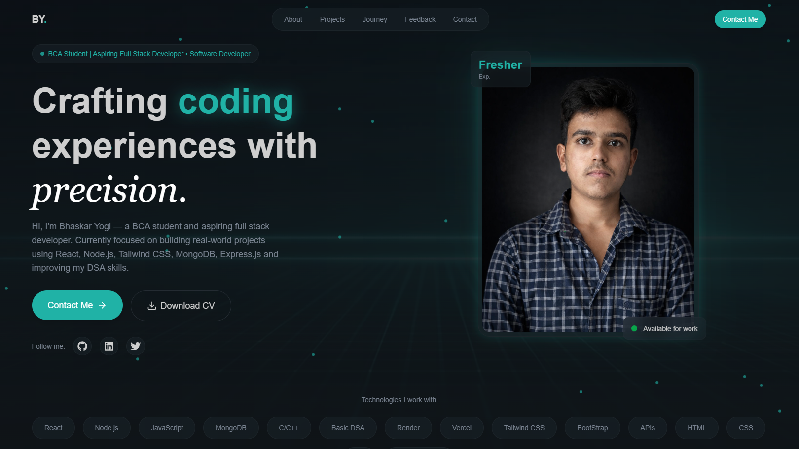
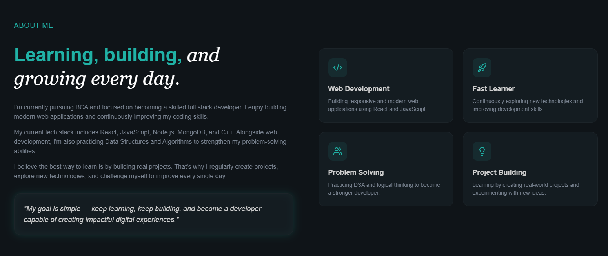
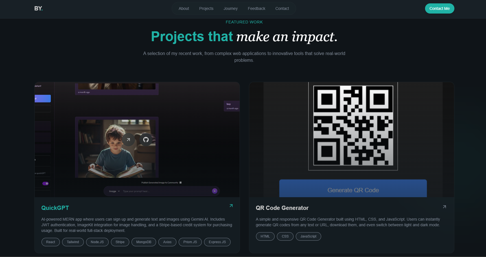
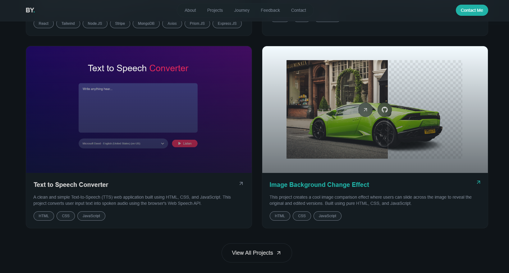
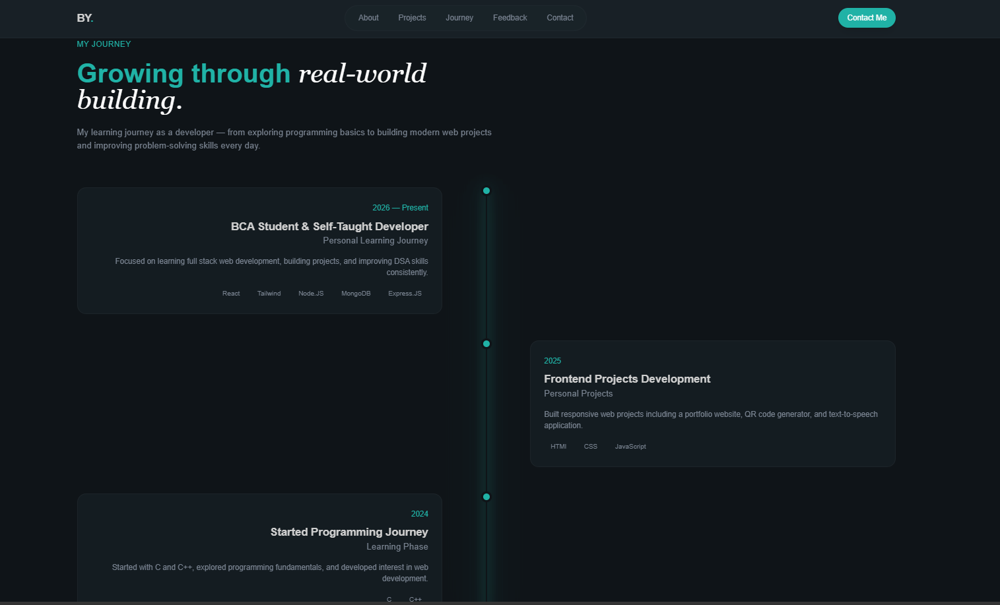
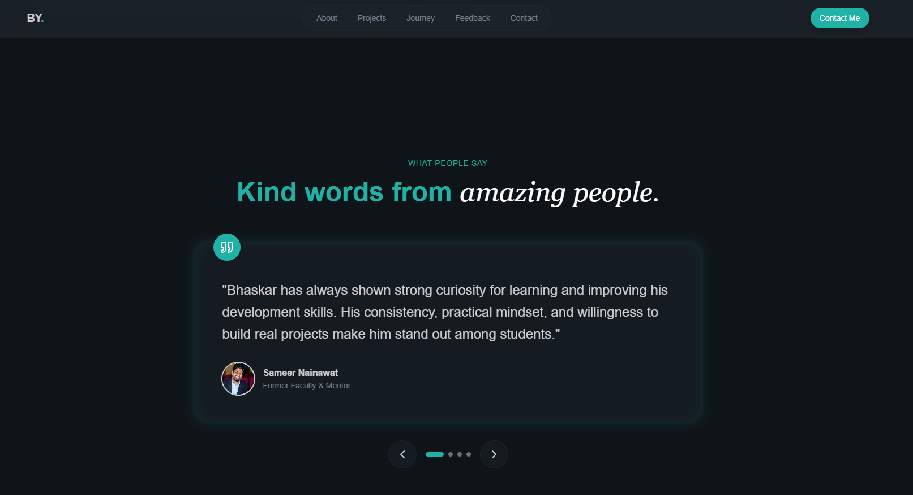
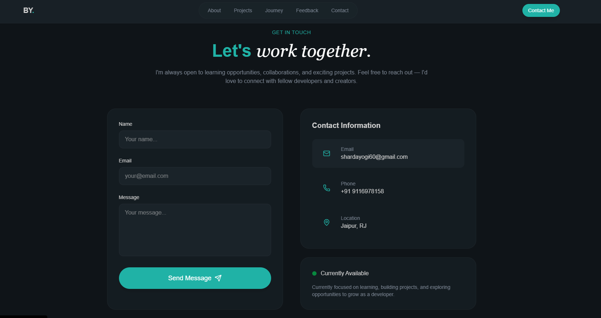

# 🚀 Bhaskar Yogi — Developer Portfolio

A modern, responsive, and visually polished developer portfolio built using **React**, **Vite**, and **Tailwind CSS v4**.

This portfolio represents my learning journey as a developer — showcasing real-world projects, technical skills, mentor feedback, and my passion for continuously building and improving.

---

# 🌐 Live Demo

👉 https://react-tailwind-personal-portfolio-rho.vercel.app/

---

# ✨ Highlights

- ⚡ Modern responsive UI
- 🎨 Glassmorphism design
- 🚀 Smooth scrolling experience
- 📱 Fully mobile responsive
- 💼 Interactive project showcase
- 📄 Download CV functionality
- 📬 Functional contact form with EmailJS
- 💬 Mentor feedback section
- 🌙 Dark premium theme
- ✨ Smooth animations & transitions

---

# 🛠️ Tech Stack

## Frontend

- React.js
- Vite
- Tailwind CSS v4
- JavaScript (ES6+)

## Libraries & Tools

- Lucide React
- React Icons
- EmailJS
- Git & GitHub

---

# 📸 Portfolio Sections

## 🏠 Hero Section
A clean introduction section with social links, resume download button, and animated UI.


## 👨‍💻 About Section
A short overview of my learning journey, skills, and development goals.


## 🚀 Projects Section
Showcases real-world projects with live demos and GitHub repositories.



## 📈 Journey Section
Represents my developer growth journey and learning path.


## 💬 Mentor Feedback
Displays feedback and guidance from mentors and peers.


## 📬 Contact Section
Allows visitors to directly connect with me using EmailJS integration.


---

# 📂 Folder Structure

```bash
PORTFOLIO/
├── public/
│   ├── projects/
│   ├── testimonials/
│   ├── hero-bg.jpg
│   └── Bhaskar_Resume.pdf
│
├── src/
│   ├── assets/
│   ├── components/
│   │   ├── AnimatedBorderButton.jsx
│   │   └── Button.jsx
│   │
│   ├── layout/
│   │   ├── Footer.jsx
│   │   └── Navbar.jsx
│   │
│   ├── sections/
│   │   ├── About.jsx
│   │   ├── Contact.jsx
│   │   ├── Experience.jsx
│   │   ├── Hero.jsx
│   │   ├── Projects.jsx
│   │   └── Testimonials.jsx
│   │
│   ├── App.jsx
│   ├── index.css
│   └── main.jsx
│
├── .env.local
├── package.json
├── vite.config.js
└── README.md
```

---

# ⚙️ Installation & Setup

## 1️⃣ Clone Repository

```bash
git clone https://github.com/bs-bhaskar/react-tailwind-personal-portfolio.git
```

---

## 2️⃣ Navigate To Project Folder

```bash
cd react-tailwind-personal-portfolio
```

---

## 3️⃣ Install Dependencies

```bash
npm install
```

---

## 4️⃣ Run Development Server

```bash
npm run dev
```

---

# 📧 EmailJS Configuration

Create a `.env.local` file in the root directory and add:

```env
VITE_EMAILJS_SERVICE_ID=YOUR_SERVICE_ID
VITE_EMAILJS_TEMPLATE_ID=YOUR_TEMPLATE_ID
VITE_EMAILJS_PUBLIC_KEY=YOUR_PUBLIC_KEY
```

---

# 📄 Resume Setup

Place your resume PDF file inside the `public` folder.

Example:

```txt
public/Bhaskar_Resume.pdf
```

---

# 🖼️ Assets Setup

## Project Thumbnails

Store project screenshots inside:

```txt
public/projects/
```

---

## Mentor Feedback Avatars

Store mentor or testimonial profile images inside:

```txt
public/testimonials/
```

---

# 🚀 Production Build

```bash
npm run build
```

---

# 🌍 Deployment

This project can be easily deployed on:

- ▲ Vercel
- 🌐 Netlify
- 🚀 Render

---

# 👨‍💻 About Me

Hi, I'm **Bhaskar Yogi** — a BCA student and aspiring full stack developer passionate about building modern web applications and improving problem-solving skills.

Currently focused on:

- React.js
- JavaScript
- MongoDB
- Node.js
- C++ & DSA
- Real-world project building

---

# 📬 Connect With Me

## 📧 Email

shardayogi60@gmail.com

## 💼 LinkedIn

https://www.linkedin.com/in/bhaskar-yogi-180b66325/

## 💻 GitHub

https://github.com/bs-bhaskar

---

# ⭐ Support

If you like this project, consider giving it a ⭐ on GitHub.

---

# 📜 License

This project is open-source and available under the MIT License.

---

# 💡 Designed & Developed By

## Bhaskar Yogi 🚀